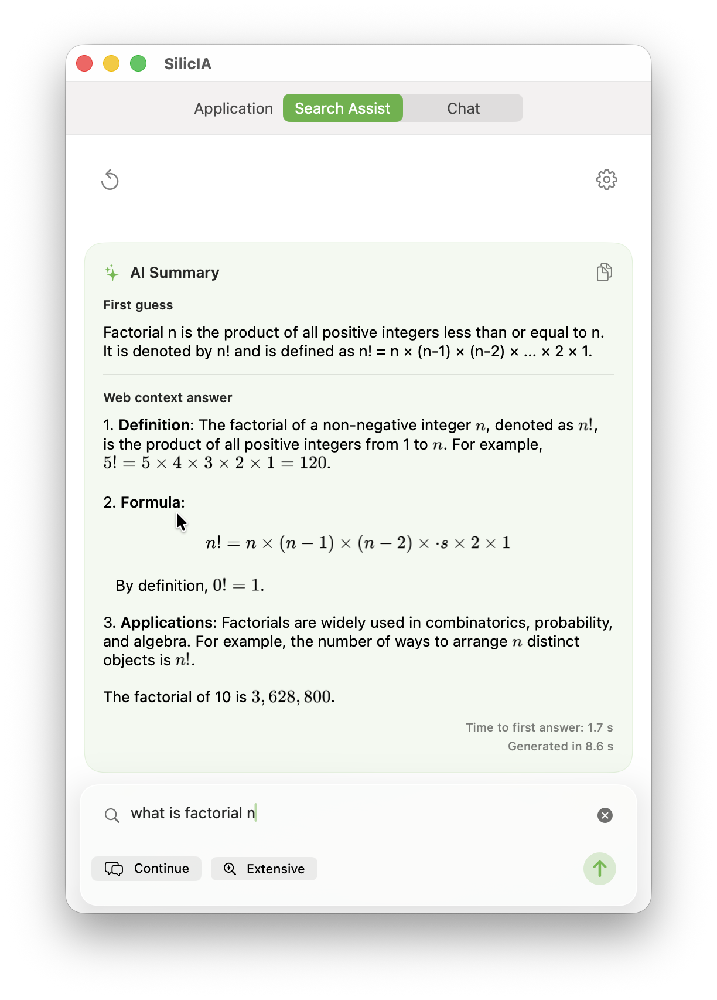

# SilicIA

[](https://github.com/Eddy-Barraud/privducuai/actions/workflows/build.yml)
[](https://github.com/Eddy-Barraud/SilicIA/actions/workflows/checkwebscrap.yml)

A fast, efficient, and privacy-focused web search assistant for macOS and iOS, powered by DuckDuckGo, Wikipedia, and Apple's on-device AI frameworks (Apple Intelligence).
The app bundles a context-aware chat experience, web scraping, PDF document analysis, and relevance-ranked retrieval — all processed on-device.

## Features

- 🔍 **Dual Search Sources**: DuckDuckGo (privacy-respecting) + Wikipedia, individually toggleable per query
- 💬 **Offline Chat Mode**: Chat with the on-device model without any web search when no sources are needed
- ⚡ **Optimized for Apple Silicon**: Runs on macOS and iOS devices with Apple Intelligence (iPhone 15 Pro or later, iPad with M-series chip, and all Apple Silicon Macs)
- 🧠 **Apple Intelligence**: Uses Apple's Foundation Models framework — processing happens entirely on-device
- 📝 **Concise Summaries**: Get quick insights without reading through multiple pages
- 🔗 **Direct Links**: Easy access to sources for detailed information
- 💬 **Tabbed Chat Experience**: Switch between Search Assist and Chat
- 📎 **Context-Aware Chat**: Add URL and PDF context (including drag-and-drop PDFs) for retrieval-augmented answers
- 💾 **Chat History**: Persistent conversation storage with SwiftData (inspired by [FoundationChat](https://github.com/Dimillian/FoundationChat))
- 🔒 **Privacy-First**: No tracking, no data collection, no external AI API calls

## Overview

SilicIA (Privacy + AI LLM) is a native macOS and iOS application that provides a privacy-focused AI search assistant experience similar to Perplexica, optimized for Apple Silicon devices with Apple Intelligence. It combines efficient web search (DuckDuckGo and/or Wikipedia — your choice) with on-device LLM summarization to help you find and understand information quickly without draining your battery.

You can also use the app in **offline chat mode**: when both search sources are disabled, the app talks directly to the on-device model without making any network requests.




### How It Works

1. **Search**: Enter your query in the search bar
2. **Fetch**: The app queries DuckDuckGo and retrieves top results
3. **Summarize**: Apple's NaturalLanguage framework analyzes the results
4. **Present**: Get a concise summary with links to full sources

## Architecture

```
SilicIA/
├── Models/
│   ├── AppSettings.swift           # User-configurable settings (language, token limits)
│   └── SearchResult.swift          # Data models for search results and metadata
├── Services/
│   ├── DuckDuckGoService.swift     # Web search integration with result fetching
│   ├── AIService.swift             # On-device AI summarization using NaturalLanguage
│   ├── ChatService.swift           # Retrieval-augmented generation orchestration
│   ├── RAGContextService.swift     # Context management for chat queries
│   └── WebScrapingService.swift    # Web page content extraction and parsing
├── Views/
│   ├── SearchView.swift            # Main search interface and results display
│   └── ChatView.swift              # Chat user interface and interaction logic
├── Assets.xcassets/                # App icons and color definitions
├── ContentView.swift               # Root view and main UI container
├── SilicIAApp.swift              # App entry point and lifecycle management
└── SilicIA.entitlements          # macOS sandbox and capability permissions
```

### Data Flow

```
User Query
    ↓
DuckDuckGoService (Web Search)
    ↓
WebScrapingService (Extract Content)
    ↓
RAGContextService (Prepare Context)
    ↓
NaturalLanguage Framework (Summarize & Analyze)
    ↓
Results Display
```

### Key Components

#### **Models**
- **SearchResult**: Structures for search results containing title, URL, description
- **AppSettings**: Configuration for language preference, token limits, and AI parameters
- **Conversation**: SwiftData model for persistent chat conversations with associated messages
- **Message**: SwiftData model for individual messages in conversations

#### **Services**
- **WebSearchService**: Orchestrates DuckDuckGo and Wikipedia searches; each source can be enabled/disabled independently with its own result-count slider
- **WebScrapingService**: Extracts and parses content from web pages for context
- **AIService**: Performs on-device summarization using Apple's Foundation Models framework
- **RAGContextService**: Manages retrieval-augmented generation context from URLs and PDFs
- **ChatService**: Orchestrates multi-step queries combining search, scraping, and AI processing; falls back to pure offline chat when all sources are off

#### **Views**
- **ContentView**: Root view managing tab navigation between Search and Chat modes
- **SearchView**: Search interface with results display and summary toggling
- **ChatView**: Conversational interface with context attachment support (drag-and-drop PDF support)
- **ConversationsListView**: Displays saved chat conversations with load and delete capabilities

## Technical Details

### Frameworks & Technologies

- **SwiftUI**: Modern declarative UI framework for macOS and iOS
- **FoundationModels**: Apple Intelligence on-device LLM (requires Apple Silicon)
- **Foundation**: Core networking with URLSession
- **NaturalLanguage**: On-device NLP for tokenization and relevance scoring
- **PDFKit**: PDF document parsing and handling

### Power Efficiency

- **URLSession Configuration**: Optimized for macOS with request timeouts
- **Request Caching**: Reduces redundant network requests with URLCache
- **Limited Results**: Fetches only top results per query to minimize data transfer
- **On-Device Processing**: No external API calls for AI processing, all NLP happens locally
- **Background Tasks**: Efficient async/await patterns for non-blocking operations

### AI Summarization Pipeline

The app uses Apple's NaturalLanguage framework instead of cloud-based LLMs:

1. **Sentence Tokenization** (`NLTokenizer`): Splits text into sentences
2. **POS Tagging** (`NLTagger`): Identifies important terms using part-of-speech analysis
3. **Relevance Scoring**: Custom algorithm calculates sentence importance based on keyword frequency and position
4. **Extractive Summarization**: Selects top-scoring sentences while preserving order and context
5. **Result Formatting**: CleanHTML output with preserved links and structure

### Search Integration

- **DuckDuckGo**: Queries the instant answer endpoint for privacy-respecting results (toggleable, 1–20 results)
- **Wikipedia**: Queries the Wikipedia API for encyclopedic context (toggleable, 1–20 results)
- **Offline mode**: When all sources are disabled, the app routes queries directly to the on-device model with no network traffic
- **Web Scraping**: Extracts full article content for deeper context
- **RAG Pipeline**: Combines retrieved documents with user queries for context-aware responses

### Chat History

Chat conversations are persistently stored using **SwiftData**, inspired by [FoundationChat](https://github.com/Dimillian/FoundationChat):

- **Conversation Model**: Stores conversation metadata (title, creation date, last update) with cascade delete rule for associated messages
- **Message Model**: Embeddable within Conversation, stores individual messages with role, content, citations, and timestamp
- **Auto-Generated Titles**: Conversation titles are automatically generated from the first user message (truncated to 50 characters)
- **Conversation List**: Browse, load, and delete previous conversations from the History view
- **Local Persistence**: All chat history stored locally on device; no cloud synchronization

### Privacy & Security

- Uses DuckDuckGo's privacy-focused search
- All AI processing happens on-device
- No user data collection or tracking
- No external API calls for language processing
- Chat history stored locally with no cloud transmission

## Multi-language support

SilicIA's UI is available in **English**, **French**, and **Spanish**. The
language selected in **Settings** drives both the user interface text and the
language used for AI prompts (system prompts, instructions, generated answers).

The translations are not tied to the operating system locale; the
`ModelLanguage` setting in the app is the single source of truth.

### Adding a new language

The localization pipeline is JSON-based and modular, so adding a new language
is a three-step change:

1. **Add an enum case.** In `SilicIA/Models/AppSettings.swift`, add the new
   case to `ModelLanguage` (e.g. `case german = "German"`) along with a code
   mapping in the `code` computed property (e.g. `.german` → `"de"`).
2. **Drop in JSON resource files.** Under `SilicIA/Resources/Localization/`,
   add one file per existing namespace using the new language code:
   `common.de.json`, `searchView.de.json`, `chatView.de.json`,
   `conversations.de.json`, `widget.de.json`. Each new file mirrors the keys
   of the matching `*.en.json` file.
3. **Translate the prompt files.** Under `SilicIA/prompts/`, add the
   `prompt.<mode>.<feature>.de.txt` files (and their `*.instructions.de.txt`
   companions) modeled on the existing `*.fr.txt` set. Keep the
   `{{variable}}` placeholders intact — they are substituted at runtime by
   `PromptLoader`.

The `LocalizationTests` smoke test in the `SilicIATests` target asserts that
every key present in the English JSON files is also present in the French and
Spanish files, so any missing key is caught at build/test time. When you add a
new language, extend the smoke test to require parity for the new code as
well.

## Requirements

- **macOS 26** or later on any Apple Silicon Mac
- **iOS 26** or later on iPhone 15 Pro / iPhone 15 Pro Max or newer, or any iPad with an M-series chip
- Apple Intelligence must be enabled in System Settings / Settings
- Internet connection for web searches (not required in offline chat mode)

## Building

1. **Clone the repository**
   ```bash
   git clone https://github.com/eddybarraud/SilicIA.git
   cd SilicIA
   ```

2. **Open the project in Xcode**
   ```bash
   open SilicIA.xcodeproj
   ```

3. **Configure signing** (for device builds)
   - Select the **SilicIA** target
   - Go to **Signing & Capabilities**
   - Enable **Automatically manage signing** and select your Team

4. **Build and run**
   - Press `⌘B` to build or `⌘R` to build and run

## Usage Tips

- Use natural language queries for best results
- The AI summary appears automatically after search
- Click on result titles to open full articles in your browser
- Toggle the summary on/off to focus on results

## Future Enhancements

Potential improvements for future versions:
- Search history and favorites
- Custom search filters
- Keyboard shortcuts
- Dark mode optimization

## License

This project is licensed under the **SilicIA Non-Commercial License v1.0**.

**Non-Commercial Use Only**: The Software is available for personal projects, academic research, evaluation, and non-profit use at no charge.

**For Commercial Use**: Contact the licensor to obtain a commercial license.

See [LICENSE](LICENSE) file for full terms and conditions.

## Contributing

Contributions are welcome! Please see [CONTRIBUTING.md](CONTRIBUTING.md) for guidelines on:
- Setting up your development environment
- Writing code that fits the project
- Submitting pull requests
- Reporting issues

Quick start:
```bash
git clone https://github.com/eddybarraud/SilicIA.git
./scripts/build.sh Debug
```

## Credits

- Created by Eddy Barraud
- Uses [LaTeXSwiftUI](https://github.com/colinc86/LaTeXSwiftUI)
- Chat history implementation inspired by [FoundationChat](https://github.com/Dimillian/FoundationChat)
